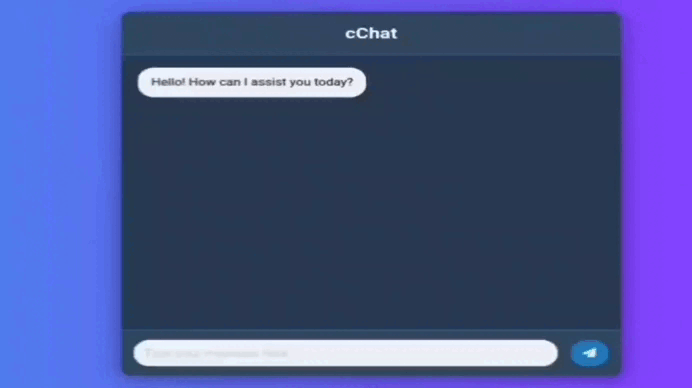
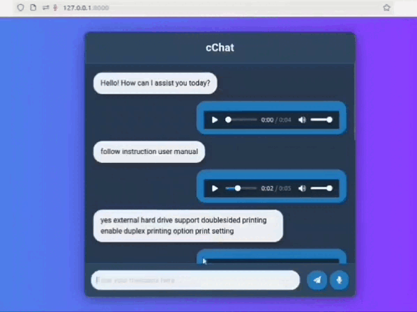

# cChat ( Technical Customer Support Chatbot )
cChat is a conversational AI chatbot designed for technical customer support, built by fine-tuning the GPT-2 model. The chatbot provides real-time assistance to users by addressing their queries. The backend API is built using FastAPI, and the front-end user interface is designed with HTML, CSS, and JavaScript, with templating handled via Jinja.





## Advance cChat (Voice Chat)



## Features
Provides real-time customer support via a chatbot interface.
Fine-tuned GPT-2 model for better technical domain-specific responses.
Easy-to-use interface built with HTML, CSS, and JavaScript.
API backend powered by FastAPI for efficient request handling.
Jinja templating for dynamic content rendering.

## Technologies Used
GPT-2: A transformer-based language model fine-tuned for customer support tasks.
FastAPI: The framework used to build the API that powers the chatbot's backend.
Jinja: A templating engine for rendering dynamic HTML content.
HTML/CSS/JS: The front-end technologies used to create the chatbot interface.

## Dataset
can download dataset from Huggingface .
Link : https://huggingface.co/datasets/coeuslearning/customerqueries

## Installation
Follow these steps to install and run the cChat application.

## Prerequisites
Make sure you have the following installed on your machine:
Python 3.8+
FastAPI
Jinja2
Uvicorn (for running the FastAPI server)
HTML/CSS/JavaScript for the front-end (optional for the back-end only setup)

## Clone the Repository
```bash
git clone https://github.com/Shymaa2611/cchat.git
cd cchat

```
## Install the required Python packages:

```bash
pip install -r requirements.txt

```

## Finetuned GPT-2 Model
Ensure you have the fine-tuned GPT-2 model checkpoint in your project directory.


## Running the Application

To start the FastAPI server, run:
```bash
uvicorn main:app --reload

```
The application will be available at http://127.0.0.1:8000.

## Sample User Interface
The chatbot interface allows users to type their queries, which are sent to the FastAPI backend. The response is displayed in the chat window. The interface is created using basic HTML, styled with CSS, and interactive with JavaScript.


## Checkpoint
checkpoint is available on drive .
Link : https://drive.google.com/drive/search?q=ChatbotCheckpoint
